# htbExplorer

**htbExplorer** es un cliente de terminal hecho en Bash ideal para trabajar cómodamente desde consola sobre la plataforma de HackTheBox.

¿Cómo ejecuto la herramienta?
======
Para empezar, tras ejecutar la herramienta, veremos lo siguiente:

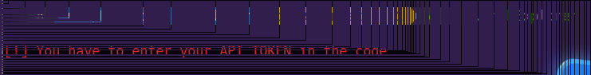

Esto es así dado que en primer lugar, necesitamos proporcionar nuestra API Key de HackTheBox.

Para ello, iniciaremos sesión en el panel de HackTheBox. Una vez logueados, haremos click derecho en nuestro perfil y posteriormente nos iremos a '**Settings**'. Dentro de esta pestaña, podremos ver un apartado con nombre '**API KEY**', desde donde podremos visualizar nuestra API Key (valga la redundancia):

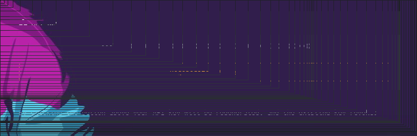

Ya en tenencia de esta API Key, es necesario introducirla en esta porción del código:

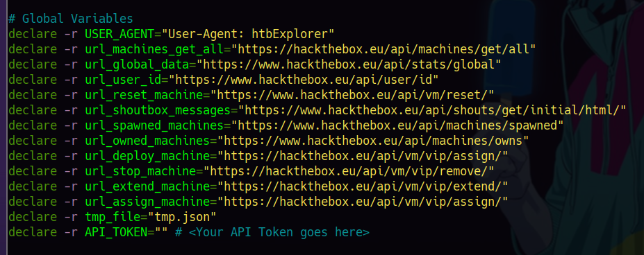

Una vez introducida, podremos ejecutar la aplicación. Tras su ejecución, veremos el siguiente panel:

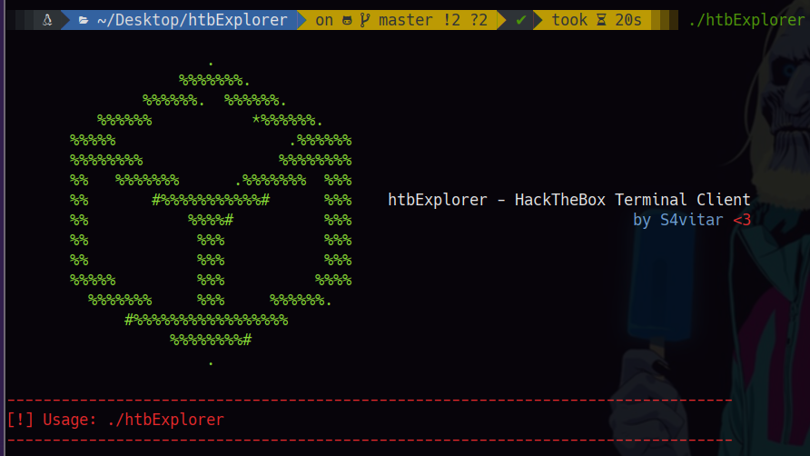

La utilidad **htbExplorer** cuenta con múltiples opciones:

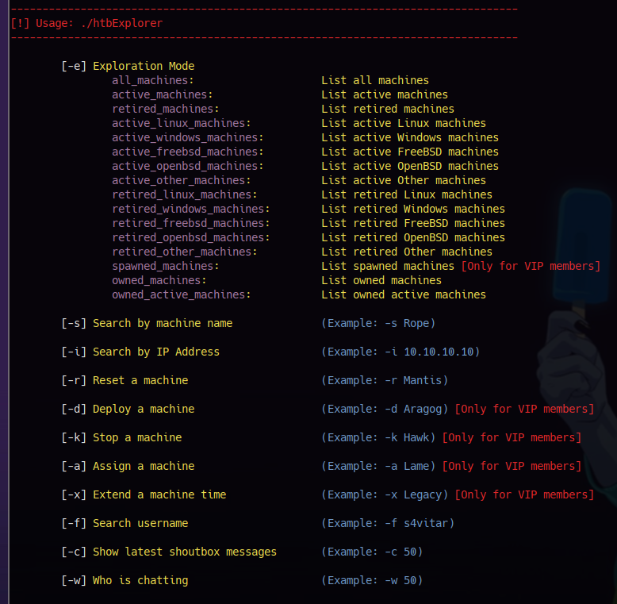

Una de ellas, es el modo de exploración. Para hacer uso de este modo, a través del parámetro '**-e**', podemos indicar el modo de exploración que queremos realizar. 

Por ejemplo, para listar las máquinas activas, haríamos '**-e active_machines**', obteniendo los siguientes resultados:

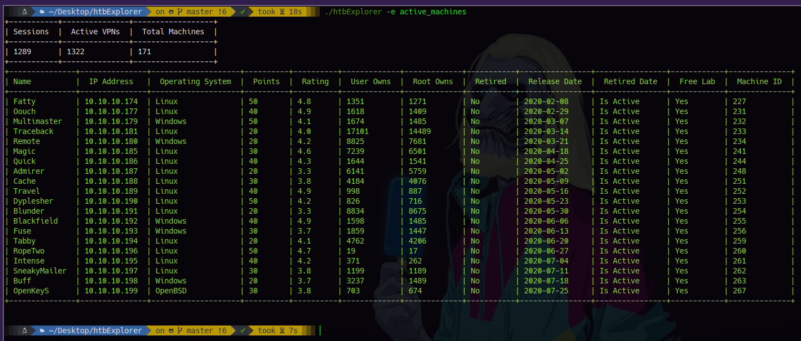

O por el contrario, para listar las máquinas spawneadas, haríamos '**-e spawned_machines**', entre los otros 14 modos de exploración (es bastante intuitivo y sencillo de usar):

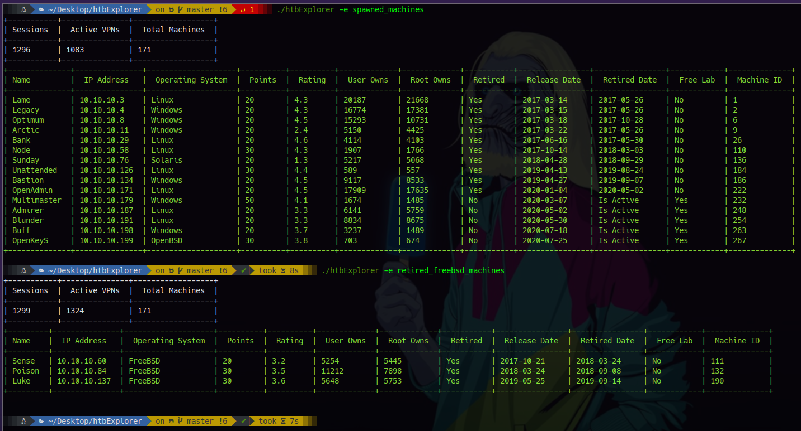

La utilidad **htbExplorer** cuenta con un buscador de máquinas por palabras clave, de forma que en todo momento podemos extraer la información más relevante de una máquina, aún sin saber su nombre entero:

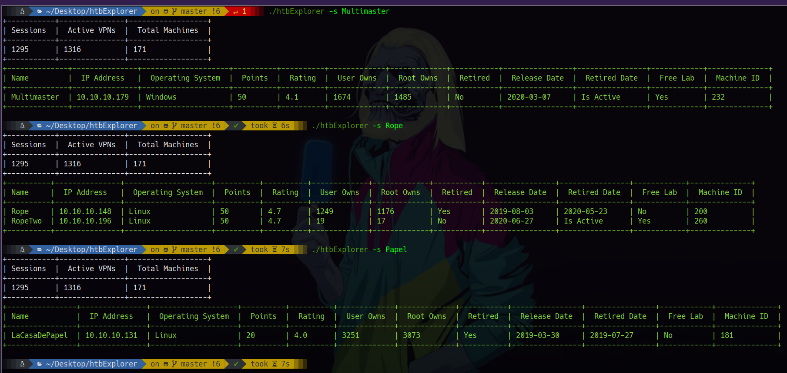

De igual manera, podemos encontrar las máquinas proporcionando la dirección IP de estas:

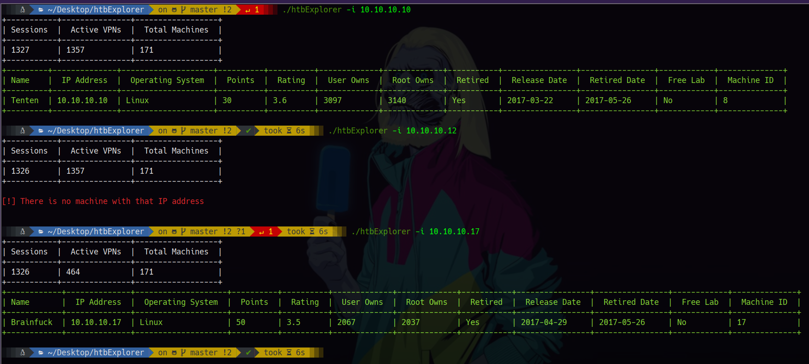

A través del parámetro '**-r**', tenemos la capacidad de reiniciar una máquina en base al nombre de máquina que especifiquemos, debiendo esperar 1 minuto para poder reiniciar otra de las activas:

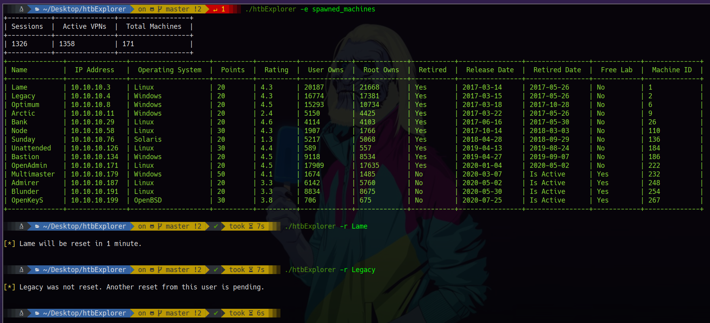

Asimismo, es posible desplegar una nueva máquina del LAB (siempre y cuando seas VIP), haciendo uso para ello del parámetro '**-d**':

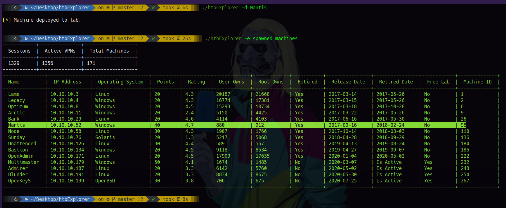

En caso de querer extender el tiempo de una máquina, o parar aquella máquina que hayamos desplegado, se puede hacer uso de los parámetros '**-x**' y '**-k**' respectivamente:

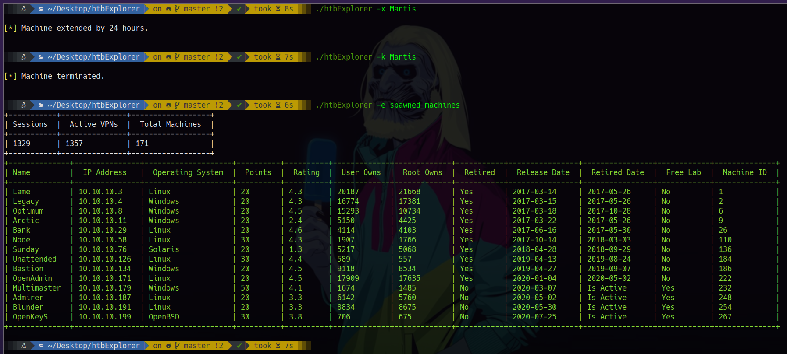

Dado que solo podemos extender el tiempo en aquella máquina de la cual seamos propietarios, para asignarte como propietario de una máquina, puedes hacer uso del parámetro '**-a**'. De esta forma, posteriormente, podrás extender su tiempo de vida a 24 horas:

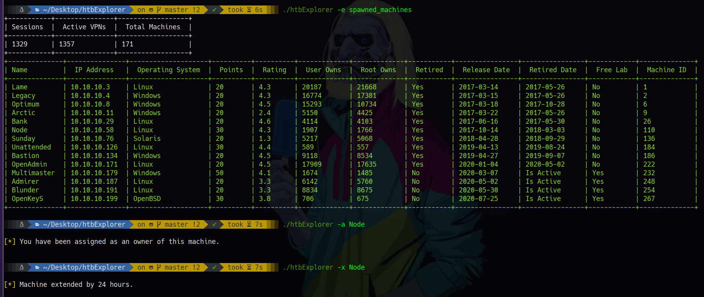

**htbExplorer** cuenta con un buscador de usuarios, representando la información más relevante de estos en tablas:

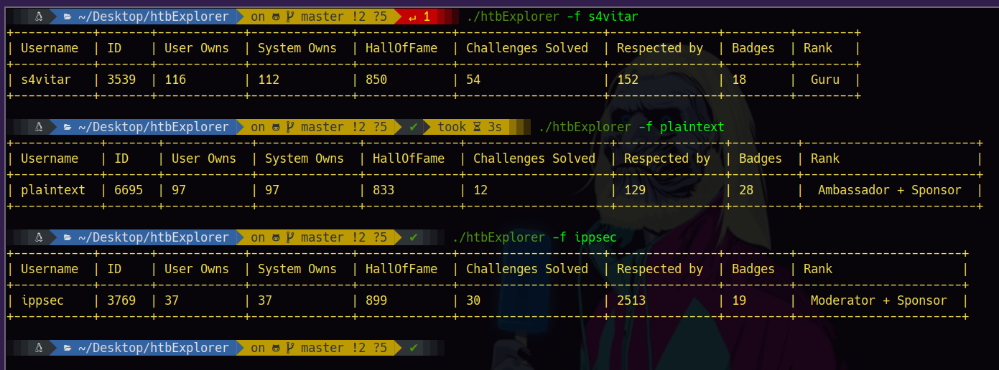

¿Quieres saber lo que se está hablando en el ShoutBox?, a través del parámetro '**-c**', puedes indicar el número de mensajes a cargar, pudiendo así ver toda la actividad:

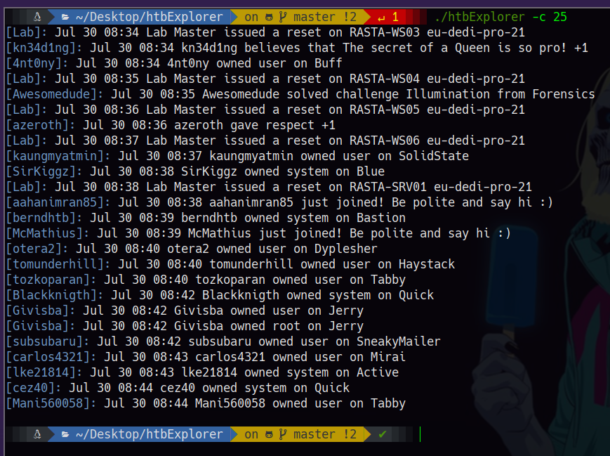

¿Eres un curioso y te gustaría saber quiénes están hablando?, no te preocupes, con el parámetro '**-w**', podrás representar la información más relevante de aquellos usuarios que estén hablando o generando actividad (siempre y cuando tengan el perfil público). También es necesario indicar el número de mensajes a cargar:

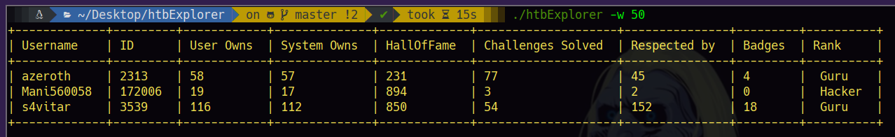

En caso de querer descargarte la VPN, ya no es necesario abrir el navegador. A través del parámetro '**-v**', podrás descargar tu VPN cómodamente indicando para ello un nombre de exportación:

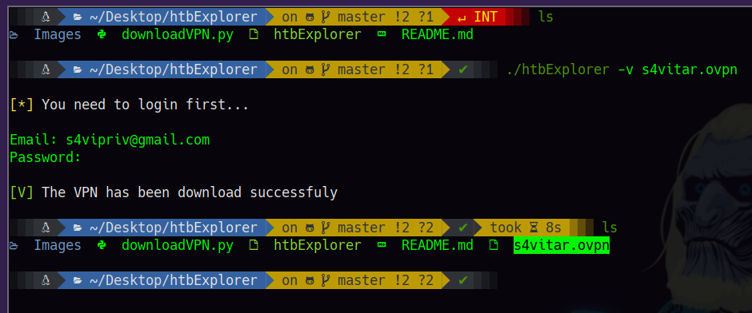

                                

TODO
======
* Poder hacer submit de una flag desde htbExplorer
* Indicar si eres propietario de alguna máquina, obteniendo el nombre de esta

